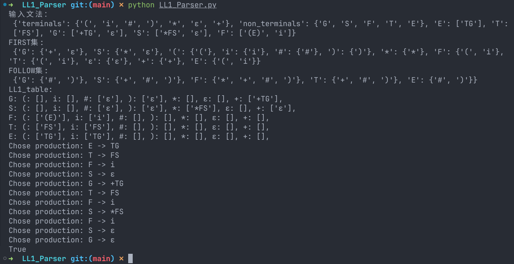

## 需求

构建一个语法分析器，使用LL1文法实现对句子的语法分析。

## 思路

第一步，读入需要分析的句子，我们需要保存文法中的产生式规则，终结符和非终结符。以下面这种数据结构保存下来。
```
输入文法：
 {'terminals': {')', 'ε', '*', '(', '#', 'i', '+'}, 'non_terminals': {'E', 'G', 'T', 'S', 'F'}, 'E': ['TG'], 'T': ['FS'], 'G': ['+TG', 'ε'], 'S': ['*FS', 'ε'], 'F': ['(E)', 'i']}
```

第二步，构建各文法符号的FIRST集。

在构建文法符号的 FIRST 集时，对于终结符，其 FIRST 集就是其自身。

对于非终结符，针对每个产生式：

- X -> a.. 如果产生式的第一个符号是终结符，将该终结符添加到当前非终结符的 FIRST 集中。
- X -> Y1Y2Y3..Ym..Yk 如果产生式的第一个符号是非终结符，将该非终结符的 FIRST 集中的所有符号（除空串 ε 外）添加到当前非终结符的 FIRST 集中。
  - 同时，检查Y1是否能推导出 ε。
    - 若可以推导出 ε，则按顺序寻找下一个不可推导出 ε 的文法符号，并将其 FIRST 集加入当前非终结符的 FIRST 集中。
    - 这个过程一直持续到找到一个不可推导出 ε 的符号，将其 FIRST 集加入。
    - 或者所有产生式都可以推导出 ε，则将 ε 加入该非终结符的 FIRST 集。

```python
def calculate_first_sets(grammar):
    first_sets = {symbol: set() for symbol in grammar['non_terminals'] | grammar['terminals']}

    for terminal in grammar['terminals']:
        first_sets[terminal].add(terminal)

    while True:
        original_first_sets = {key: value.copy() for key, value in first_sets.items()}

        # 对于每个非终结符的每个产生式：
        for non_terminal in grammar['non_terminals']:
            for production in grammar[non_terminal]:
                # X -> a.. 如果产生式的第一个符号是终结符，将该终结符添加到当前非终结符的 FIRST 集中。
                if production[0] in grammar['terminals']:
                    first_sets[non_terminal].add(production[0])
                else:
                    # X -> Y1Y2Y3 如果产生式的第一个符号是非终结符，将该非终结符的 FIRST 集中的所有符号（除空串 ε 外）添加到当前非终结符的 FIRST 集中。
                    first_sets[non_terminal] |= first_sets[production[0]].difference({'ε'})
                    # 找到一个不能推导出 ε 的符号
                    for symbol in production:
                        if 'ε' in first_sets[symbol]:
                            continue
                        first_sets[non_terminal] |= first_sets[symbol]
                        if 'ε' not in first_sets[symbol]:
                            break
                    else:
                        first_sets[non_terminal].add('ε')

        if original_first_sets == first_sets:
            break

    return first_sets
```

第三步，构建FOLLOW集，同FIRST集，代码中加入了注释。需要注意的是非终结符才有FOLLOW集合，我们要给开始符号的FOLLOW集合手动加入`#`

```python
def calculate_follow_sets(grammar, first_sets):
    follow_sets = {symbol: set() for symbol in grammar['non_terminals'] }

    follow_sets['E'].add('#')

    while True:
        # 只考虑非终结符
        original_follow_sets = {key: value.copy() for key, value in follow_sets.items()}

        for non_terminal in grammar['non_terminals']:
            for production in grammar[non_terminal]:
                for i, symbol in enumerate(production):
                    # 存在一个产生式A→αB
                    if i == len(production) - 1 and symbol.isupper():
                        follow_sets[symbol] |= follow_sets[non_terminal]
                        break
                    # 如果存在一个产生式A→αBβ
                    if symbol.isupper():
                        # 将后面的符号的 First 集（除去空串 ε）添加到当前非终结符的 Follow 集中。
                        follow_sets[symbol] |= first_sets[production[i+1]].difference({'ε'})
                        # 存在产生式A→αBβ且first（β）包含ε
                        if 'ε' in first_sets[production[i+1]]:
                            follow_sets[symbol] |= follow_sets[non_terminal]

        if original_follow_sets == follow_sets:
            break

    return follow_sets
```

第四步，构建LL1分析表

这里要会计算整个产生式右部`符号串的FIRST集`，当计算一个产生式右部的符号串的 FIRST 集时，按顺序遍历该符号串，依次将每个语法符号的 FIRST 集添加到结果集中。如果第一个语法符号的 FIRST 集包含空（ε），则将第二个符号的 FIRST 集加入；如果第二个符号的 FIRST 集也包含空，继续加入下一个符号的 FIRST 集，以此类推。

对于每个非终结符号，针对其每个产生式：

- 获取产生式右部符号串的 FIRST 集，并移除其中的空，得到一个终结符集合。
- 如果产生式右部符号串的 FIRST 集含有空，则需将当前文法符号的 FOLLOW 集加入得到的终结符集合。
- 最后，将当前产生式填入当前非终结符对应的终结符在分析表中的位置。


```python
def calculate_first_of_string(string, first_sets):
    first_set = set()

    for symbol in string:
        first_set |= first_sets[symbol]

        if 'ε' not in first_sets[symbol]:
            break

    return first_set

def build_ll1_table(grammar, first_sets, follow_sets):
    terminals = grammar['terminals']
    non_terminals = grammar['non_terminals']

    ll1_table = {non_terminal: {terminal: [] for terminal in terminals} for non_terminal in non_terminals}

    # 对于每个文法的每个产生式，去计算每个产生式右部符号串的first集，并判断有无空在里面，如果有，考虑follow集
    for non_terminal in non_terminals:
        for production in grammar[non_terminal]:
            first_set = calculate_first_of_string(production, first_sets)

            for terminal in first_set:
                if terminal != 'ε':
                    ll1_table[non_terminal][terminal].append(production)

            if 'ε' in first_set:
                for terminal in follow_sets[non_terminal]:
                    ll1_table[non_terminal][terminal].append(production)

    return ll1_table
```

第五步，实现分析器

记得初始化符号栈为`['#', 'E'] `，开始分析过程即可。

```python
def parse_input_string(input_string, ll1_table):
    stack = ['#', 'E'] 
    input_string += '#'  
    index = 0 

    while stack:
        top = stack[-1]
        current_input = input_string[index]

        # 对当前栈顶符号进行匹配
        # 终结符
        if top.isupper():
            if ll1_table[top][current_input]:
                popped = stack.pop()

                for symbol in reversed(ll1_table[top][current_input][0]):
                    if symbol != 'ε':
                        stack.append(symbol)

                print(f"Chose production: {popped} -> {ll1_table[top][current_input][0]}")
            else:
                # 分析表中没有对应的产生式
                return False
        # 非终结符并且匹配成功
        elif top == current_input:
            stack.pop()
            index += 1
        else:
            return False

    return True
```

## 结果

成功实现语法分析😊

