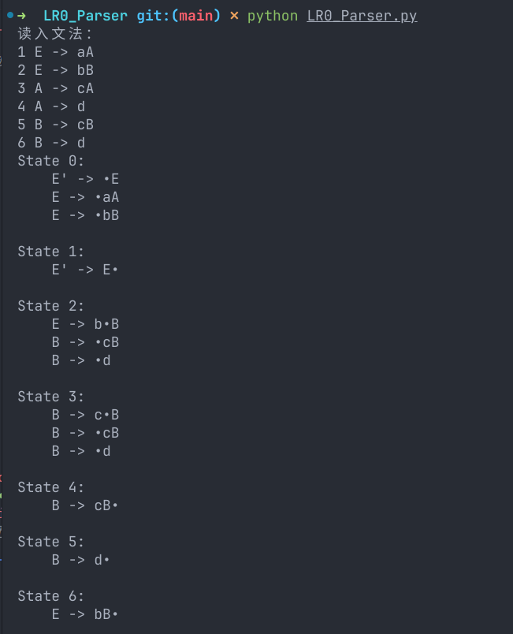
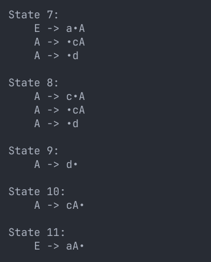
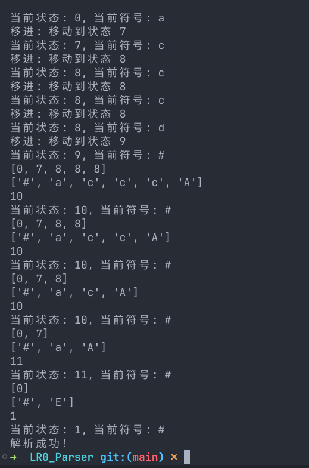

## 需求
构建一个语法分析器，要求使用自底向上LR0方法分析。

## 思路

第一步，依然是从文件中先读入文法，保存产生式，和之前实验几乎一样，这里不赘述了。

第二步，构建出项目集规范族，就是LR分析法中构造出来的DFA中各个状态集的集合。
- 需要先手动构造出0号状态集，并求其闭包。
- 执行goto操作以获取新的状态集，再求新的状态集的闭包
- 再对新的状态集执行goto操作
- ...
其实这就是一个递归的过程，我们只需要写一个函数处理需要goto的状态集即可，这个函数处理完需要goto的状态集会生成goto后的状态集，这些状态集当然也是需要goto的，那我们调用自己就好了，直到没有新的状态集生成。

构建项目规范族
```python
# 构造项目集规范族
def build_item_sets(productions):
    item_sets = []  # 存储所有的项目集

    # 构建初始状态，即 0 号状态
    initial_item_set = []  
    initial_item_set.append(Production("E'", "•E"))  

    # 为0号状态执行闭包操作
    closure(initial_item_set, productions)
    item_sets.append(initial_item_set)  # 将初始状态添加到项目集规范族中

    def recursive_build(item_set):
        # 对当前状态的每个符号进行扩展
        for symbol in get_symbols(item_set):  # 获取项目集中的所有符号（非终结符和终结符）
            new_item_set = goto(item_set, symbol, productions)  # 通过 Goto 操作生成新的项目集
            if new_item_set and new_item_set not in item_sets: 
                closure(new_item_set, productions)  # 对新的项目集执行闭包操作
                item_sets.append(new_item_set)  # 将新状态添加到项目集规范族中
                recursive_build(new_item_set)  # 递归构建新状态

    recursive_build(initial_item_set)  # 从初始状态开始递归构建状态

    return item_sets  # 返回构建完成的项目集规范族
```

闭包函数
```python
# 获取项目集的闭包
# 闭包可以理解为扩展，由一个项目扩展到一整个项目集，这个集合里的项目是在状态上是等价的。
# 等待的是一个非终结符那么就是可以扩展的
# 去遍历当前项目集每一个活前缀看看能否扩展即可。
# 需要多次遍历
def closure(item_set, productions):
    while True:
        new_items = []  # 存储新加入的项目
        added = False  # 标记是否有新项目被添加
        for item in item_set:
            dot_index = item.right.find('•')
            if dot_index != len(item.right) - 1:  # 如果点不在右部末尾
                next_symbol = item.right[dot_index + 1]  # 获取点后面的符号
                if next_symbol in productions:  # 如果是非终结符
                    # 添加非终结符的所有产生式到闭包中
                    for prod in productions[next_symbol]:
                        new_item = Production(next_symbol, '•' + prod.right)
                        if new_item not in item_set and new_item not in new_items:
                            new_items.append(new_item)
                            added = True 
        if not added:
            break
        item_set += new_items  # 将新产生的项目加入闭包
```


goto函数
```python
def goto(item_set, symbol, productions):
    """
    获取当前状态，来了一个symbol之后，将会转移到的状态

    Args:
        item_set: 当前状态集.
        symbol: 参数.
        productions: 产生式规则
    Returns:
        type: 一个状态集，为当前状态转移到的状态集
    """
    new_item_set = []  # 存储移进后的项目集
    for item in item_set:
        dot_index = item.right.find('•')
        if dot_index != len(item.right) - 1 and item.right[dot_index + 1] == symbol:
            new_right = item.right[:dot_index] + symbol + '•' + item.right[dot_index + 2:]
            new_item_set.append(Production(item.left, new_right))
    closure(new_item_set, productions)  # 对移进后的项目集执行闭包操作
    return new_item_set
```

第三步，根据构建好的项目规范集，构造出LR0分析表。
- 移进项目
  - 枚举每一个终结符和非终结符，并尝试在当前状态集下goto，看能否goto成功，能那么是移进项目
- 规约项目
  - 项目集第一个产生式以•结束就是规约项目。

构建分析表
```python
def fill_LR0_table(item_sets, productions, terminals, non_terminals):
    """
    构建LR0分析表
    """
    action_table = {}  # 初始化 Action 表
    goto_table = {}    # 初始化 Goto 表
    terminals.add('#') 
    # 遍历状态集
    for i, item_set in enumerate(item_sets):
        # 考虑移进项目
        # 思路是枚举每一个终结符和非终结符，并尝试在当前状态集下goto，看能否goto成功，能那么是移进项目
        for symbol in terminals | non_terminals:
            if symbol in terminals:
                next_state = goto(item_set, symbol, productions)
                if next_state:
                    action_table[i, symbol] = ('shift', item_sets.index(next_state))
            
            else:
                next_item_set = goto(item_set, symbol, productions)
                if next_item_set in item_sets:
                    goto_table[i, symbol] = item_sets.index(next_item_set)
        # 考虑每个状态集第一个产生式是否为归约项目
        prod = item_set[0]
        if prod.right.endswith('•'):
            # 找到规约产生式的编号
            ind = 1
            tar = None
            for left in productions:
                for item in productions[left]:
                    if item.right == prod.right.split('•')[0] and item.left == prod.left: 
                        tar = ind
                        break
                    ind += 1
            # 规约的时候，当前状态集遇到任意非终结符都进行规约！
            for symbol in terminals:
                if tar != None:
                    action_table[i, symbol] = ('reduce', tar)  

        if 'E' in item_set[0].left and item_set[0].right == 'E•':
            action_table[i, '#'] = 'accept'  
    
    return action_table, goto_table
```

第四步，实现解析函数。需要维护两个栈，和指向输入符号串的指针，之后不断查表实现分析即可。需要注意的是规约时候符号栈和状态栈都需要弹出相同数量的元素。并且规约之后需要解决符号栈状态栈数量不平衡的问题。

```python
def parse(input_string, action_table, goto_table, productions):
    """
    对输入的句子按照LR分析表开始语法分析。
    """
    stack_state = [0] 
    stack_symbol = ['#']
    input_symbols = input_string.split()[0] + '#'  # 输入符号串
    index = 0

    while True:
        current_state = stack_state[-1]
        current_symbol = input_symbols[index]

        print(f"当前状态: {current_state}, 当前符号: {current_symbol}")

        action = action_table.get((current_state, current_symbol))

        if action:
            
            if action== 'accept':
                print("解析成功！")
                return True
            
            action_type, action_value = action
            
            if action_type == 'shift':
                stack_symbol.append(current_symbol)
                stack_state.append(action_value)
                index += 1
                print(f"移进: 移动到状态 {action_value}")
            elif action_type == 'reduce':
                productions_for_reduce = None
                ind = 1
                for left in productions:
                    for proc in productions[left]:
                        if ind == action_value:
                            productions_for_reduce = proc
                        ind += 1
                
                # 规约时候符号栈和状态栈都需要弹出相同数量的元素
                for _ in range(len(productions_for_reduce.right)):
                    stack_symbol.pop()
                    stack_state.pop()
                stack_symbol.append(productions_for_reduce.left)
                print(stack_state)
                print(stack_symbol)
                # 解决符号栈状态栈数量不平衡的问题
                while stack_state.__len__() != stack_symbol.__len__():
                    print(goto_table.get((stack_state[-1], stack_symbol[-1])))
                    stack_state.append(goto_table.get((stack_state[-1], stack_symbol[-1])))
                
            else:
                print("解析失败：无效的操作")
                return False
        else:
            print("解析失败：未找到动作")
            return False
```

## 结果
分析成功😊




